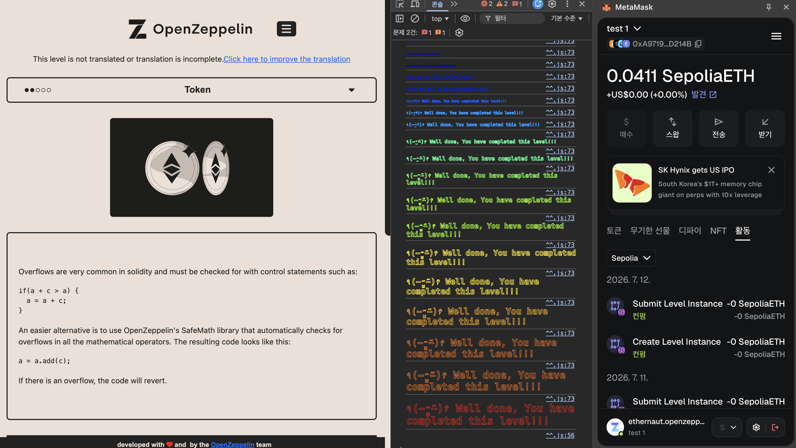

# [Ethernaut] 05-token

## 취약점 요약
이번 문제는 solidity 0.8.0 미만 버전에서 컴파일러가  
언더플로우, 오버플로우 검사를 하지 않는다는 취약점을 이용해  
많은 양의 token을 얻어내는 문제입니다.

## 사전 지식
1. **Integer Underflow**:  
데이터 타입이 표현할 수 있는 최소값보다 더 작은 값을 만들려고 할 때  
발생합니다.

2. **solidity 0.8.0 미만 버전의 취약점**
여러 취약점이 있겠지만 해당 문제를 풀기 위해서 알아야 하는 취약점은  
0.8.0 미만 버전에서는 컴파일러가 따로 언더,오버플로우 검증을 하지 않는다는 점입니다.

## 취약 코드
```solidity
    function transfer(address _to, uint256 _value) public returns (bool) {
            /* _value 인자는 uint형이기 때문에  
              결과 값이 0보다 큰지 검증하는 건 의미가 전혀 없음 
              항상 참이 되어버림 */
        require(balances[msg.sender] - _value >= 0);
        balances[msg.sender] -= _value;
        balances[_to] += _value;
        return true;
    }
```

## 원인 분석
### **solidity 버전 취약점 간과 및 언더,오버플로우 검증 부재**  
- transfer() 함수의 검증 로직은 아래와 같습니다.
```solidity
require(balances[msg.sender] - _value >= 0);
```
- 함수의 인자들은 모두 uint형으로 선언 되어 있기에 음수가 될 수 없습니다.  
따라서 해당 코드는 항상 참이 될 수 밖에 없고 의미 없는 코드 한 줄이 되어버립니다.  
거기에 더해 solidity 0.8.0 미만 버전은 언더,오버플로우 검증을 따로 하지 않기에  
공격자가 언더플로우를 발생시켜도 막을 방법이 없습니다.

- _value에 어떤값이 들어가는지 검증하지 않기 때문에  
**balances[msg.sender]**보다 큰 값을 **_value**에 넣는다면  
언더플로우를 발생 시킬 수 있고 매우 많은 token을 가져올 수 있습니다.

## 익스플로잇 로직

```bash
cast send <인스턴스 주소> "transfer(address,uint256)" 0x0000000000000000000000000000000000000001 21 --rpc-url [RPC_URL] --account <지갑 계정>
```

<small>
이 문제 클리어 조건은 **msg.sender**의 잔고를 늘리는 것이기에 **_to** 인자에 의미 없는 주소를 넣어줬습니다.
</small>  


**flag!**  


## 수정 방안
```solidity
    function transfer(address _to, uint256 _value) public returns (bool) {
            // _value 인자값 검증하기
        require(balances[msg.sender] >= _value, "Insufficient balance");
        balances[msg.sender] -= _value;
        balances[_to] += _value;
        return true;
    }
```

```solidity
    // 버전 0.8.0 이상으로 올리기
pragma solidity ^0.8.0;

contract Token {
    mapping(address => uint256) balances;
    uint256 public totalSupply;

    // constructor, transfer, balanceOf 함수는 기존과 동일
}
```

## CWE 분류
- **CWE-191 (Integer Underflow)**
